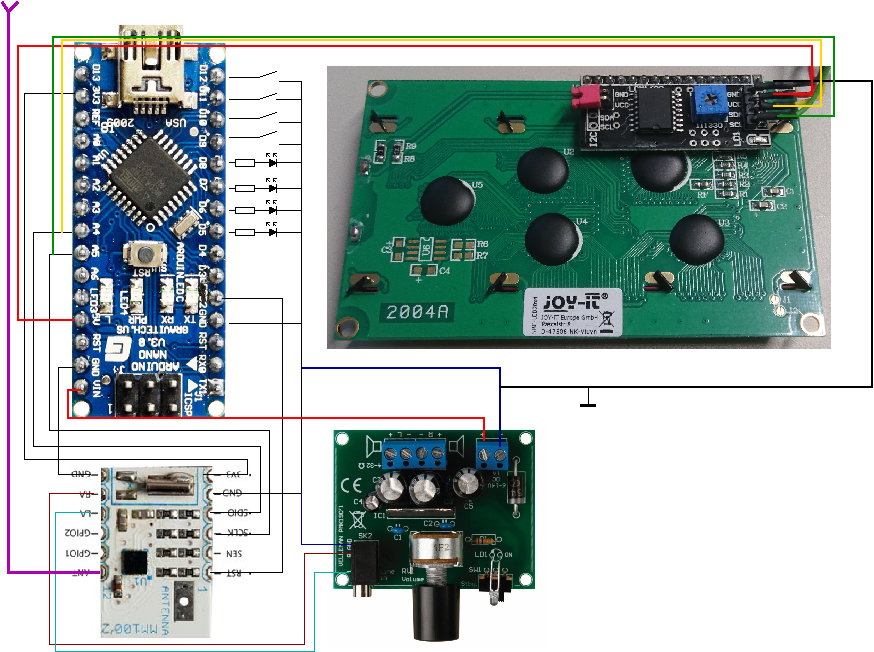
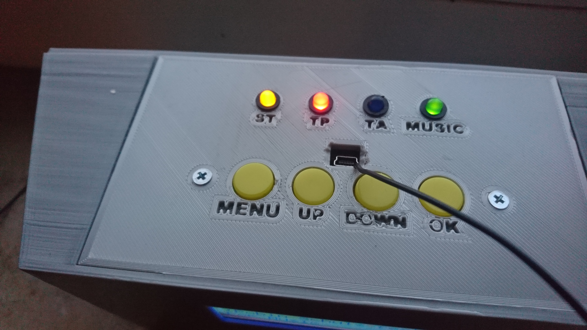
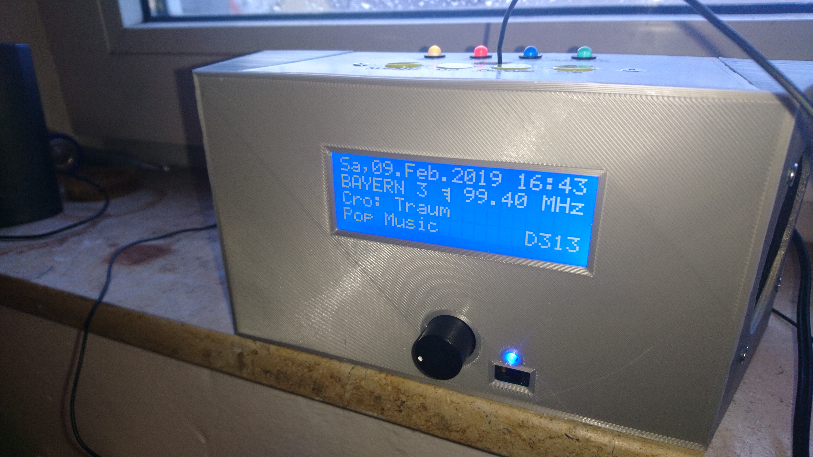

# RDS-Radio
A modified version of **Matthias Hertel's** Radio library for Velleman MM100 / arduino / LCD2004 / Velleman MK190

Matthias Hertel's Radio library:
https://github.com/mathertel/Radio

Features *Station name*, *RDS text* (scrolling if longer than 20 charcters long), 
*Time and Date* corrected for local offset, *Signal strength* as an antenna symbol, 
*Alternative frequencies*, *Programme type* PTY, *PI code*, Display dark mode for better audio   

Some parts: 
Velleman MM100:
https://manuals.velleman.eu/article.php?id=706

Velleman MK190:
https://www.velleman.eu/products/view?id=387602

I2C LCD Display 20x4: 
http://anleitung.joy-it.net/?goods=i2c-serial-20x4-2004-lcd-modul

Schematics:

